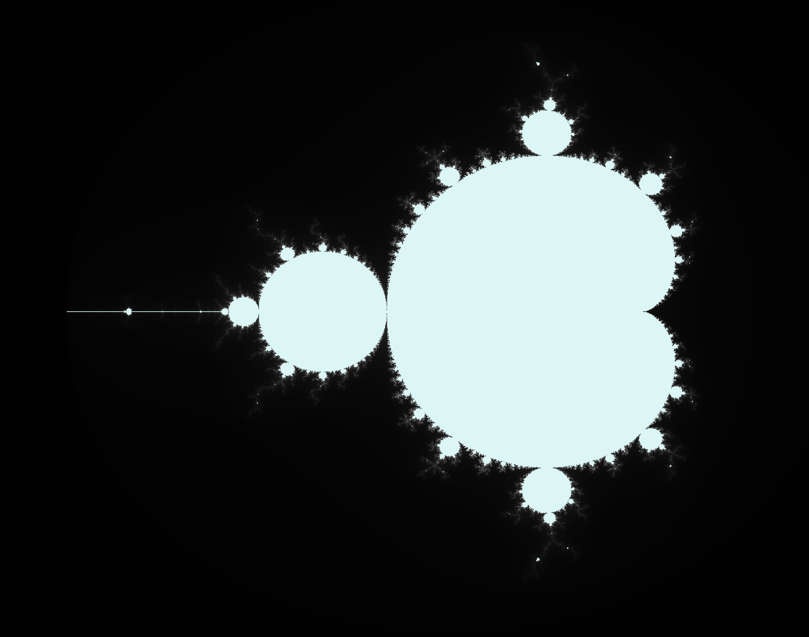
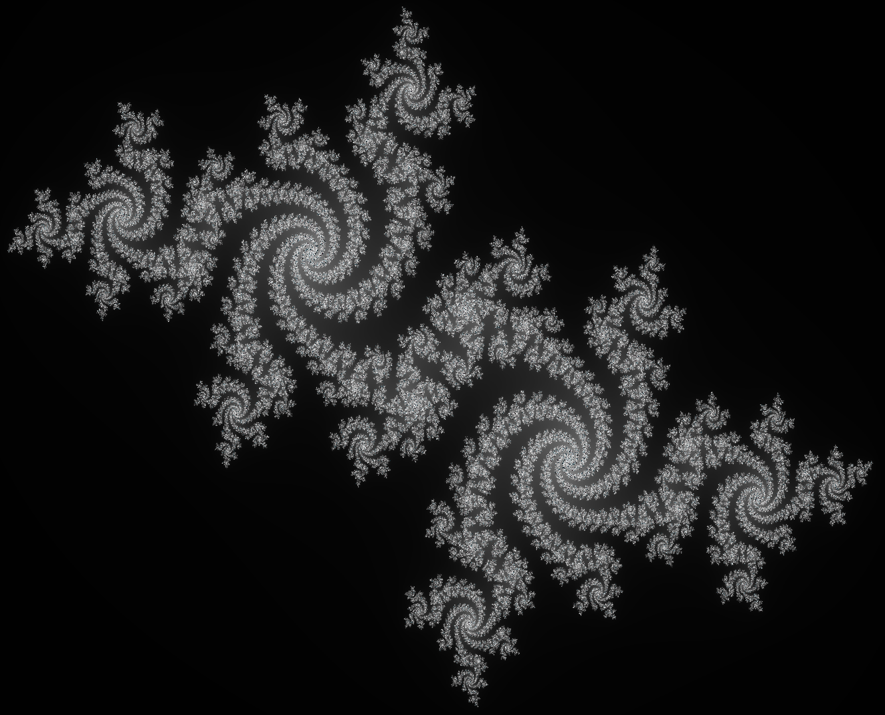

# Fractol Project

Welcome to the Fractol project! This project explores fractals using interactive visualization techniques. Currently, it focuses on two famous fractals: the Mandelbrot set and Julia sets.

## Mandelbrot Set

The Mandelbrot set is a set of complex numbers \( c \) for which the function \( f(z) = z^2 + c \) does not diverge when iterated from \( z = 0 \). Here's an image of the Mandelbrot set:

*Image source: project results*

### Features
- Zooming and panning to explore different regions of the Mandelbrot set.
- Color gradients to visualize the iteration counts.

## Julia Sets

Julia sets are related to the Mandelbrot set and are defined similarly. Each point \( c \) in the complex plane corresponds to a unique Julia set. Here's an image of a Julia set:

*Image source: project results*

### Features
- Interactive parameter selection to generate different Julia sets.
- Real-time rendering and visualization of Julia sets.

## Usage

To run the Fractol program:

1. Clone this repository.
2. Run `bash setup_libs.sh` and Compile the program by running `make`.
3. Run the executable.

Ensure you have the necessary dependencies and libraries installed as specified in the project documentation.

## Requirements

- C compiler (e.g., GCC)
- Graphics library (e.g., MinilibX)

## Contribution

Contributions to this project are welcome! If you find any issues or have suggestions for improvements, feel free to open an issue or submit a pull request.

## License

This project is licensed under the MIT License - see the [LICENSE](LICENSE) file for details.
